# how to build a r_e_c_u_r

## get some parts

_ [here](parts_and_sources) is a document of different parts and sources that people have used for building recur. For other questions check out the [faq] , or get in touch._

these are the parts you need to get. to reduce shipping costs to nz i sourced them through aliexpress.com but you could equally get them from ebay, amazon or elsewhere. 

### main parts:

__NOTE: pi4 is currently not supported yet__

- [raspberry pi3] *37 USD*

- [raspberry pi screen] *12 USD*

- [usb keypad (AliExpress)] or [usb keypad (Amazon)]  *9 USD*

![main parts][main parts]

### optional c_a_p_t_u_r addons:

for live sampling, and processing of external sources a video input is required. one option is to input video through the rpi CSI port. this is low latency higher quality, the options include:

- [raspberry pi camera] *7 USD*
- or [piCaptureSd1] *149 USD*

![csi capture parts][csi capture parts]

another option is to input video through USB. this generally includes some latency and the quality - and compatibility - varies between devices, but can be a cheaper alternative. some usb options include:

- [easyCap UTV007] *5 USD*
- or [August VGB300] Capture *30 USD*
- PS3 EyeToy, or other USB webcams

![usb capture parts][usb capture parts]

### other bits and pieces:

- raspberry pi [composite cable]

- 4x m2 and 6x m3 screws, 6mm is long enough - i ended up using 4 2-gauge and 6 4-gauge self tapping screws instead which were easier to get into the plastic case.

- 8 gb or greater mircoSD card

- a stable 5volt, 1A microUsb power supply

- some rubber feet for the bottom ? i had [these rubber feet] around from a previous project that work nicely

## print some things

- i 3d printed my enclosure using these files for the [top] and [bottom]. if you dont have access to a printer you can upload these files to a popular printing service in you region (eg ...)

- _note on enclosure: you could also just buy a standard raspberry pi3 (+screen) case and use the numpad externally. i personally found the 3d printing took a bit too long so am working on a lasercut-able option too. watch this space_

- 2d print these [key stickers] if you want to use the default key mapping, or modify the svg file (in inkscape or something) to create your own. you could print them onto vinyl, label paper or just normal paper and attach with with double sided tape... some people just use masking tape and a sharpie to mark the keys !

## put it together

- to get a raspberry pi working you need a micro-sd card with the operating system flashed onto it.

- the easiest way to run recur is by using [etcher] to flash your micro sd with my [modified image] of raspbian.
(i have tried to document my steps from a fresh image of raspbian to recur if you want to learn here [instructions to install] although this is more difficult and time consuming.)

- insert sd card into pi

- use the 4 small screws to attach pi+screen to the bottom piece of enclosure

- attach the lcd screen via the pi header pins so it fits exactly on top of the pi. (some little spacers could be used to support the top corners of the screen)

- put a battery in the keypad , insert its usb dongle into the pi. fasten the keypad to the baseplate; i used some double sided tap along raised strips - although now im thinking superglue might hold better...

- use the 6 large screws to hold the top panel to the bottom

you are done ! wasnt that easy ?

## try it out !

( [operate docs] )

## my v1 build gallery !

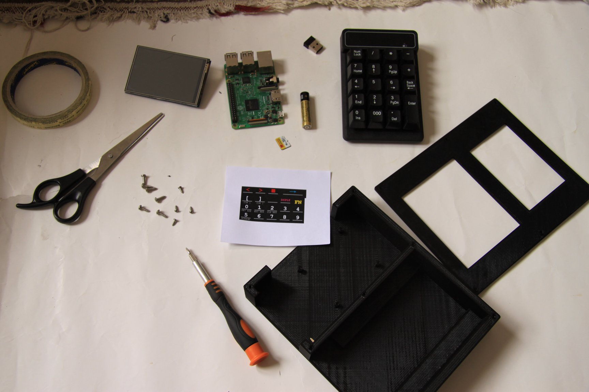 

all the parts and tools i used in this build

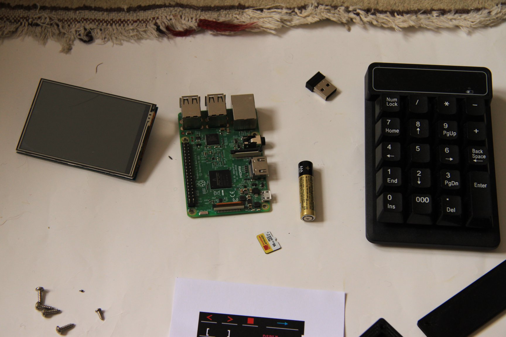 

the main playaz : raspi-lcd-screen , raspi3 , generic usb-keypad

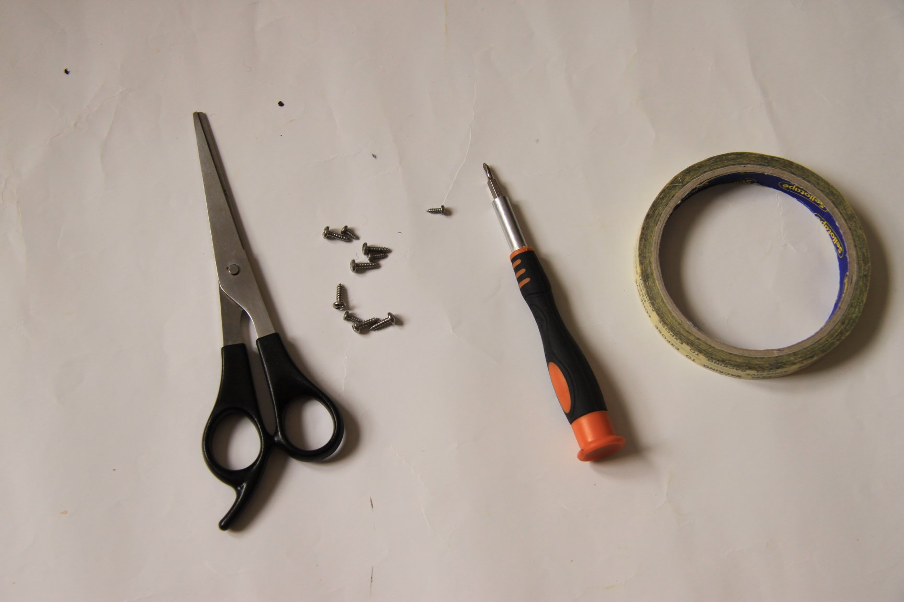 

tools even your mums house would have lying around...

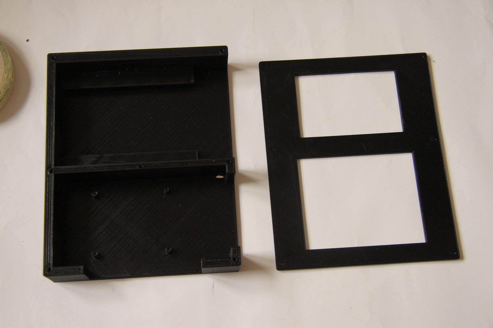 

3d printed baseplate and top panel

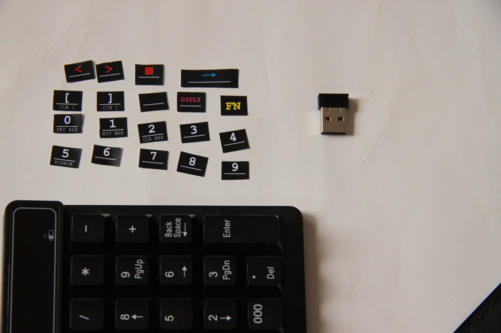 

ctrl-c

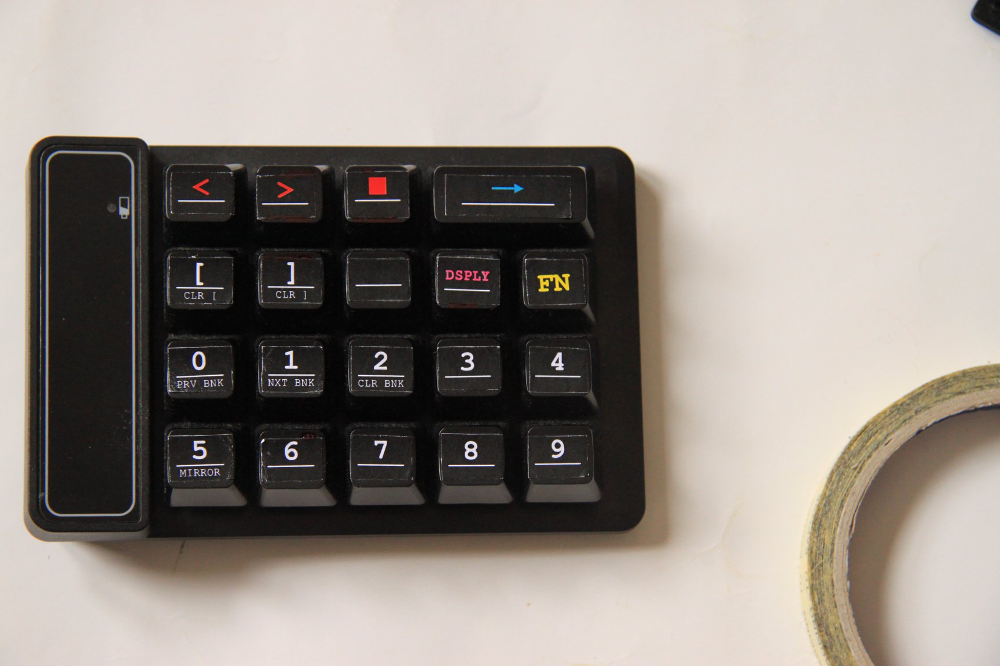 

ctrl-v

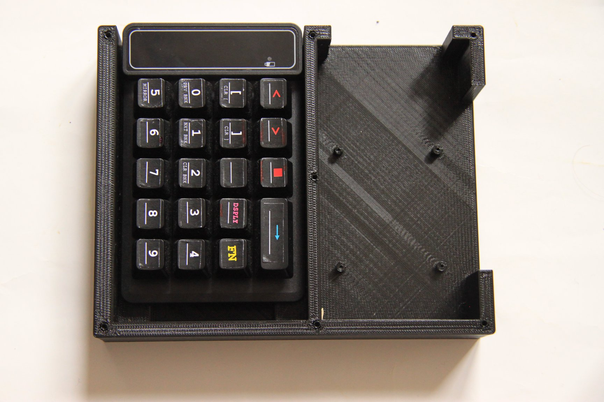 

held in with double-sided tape on bottom

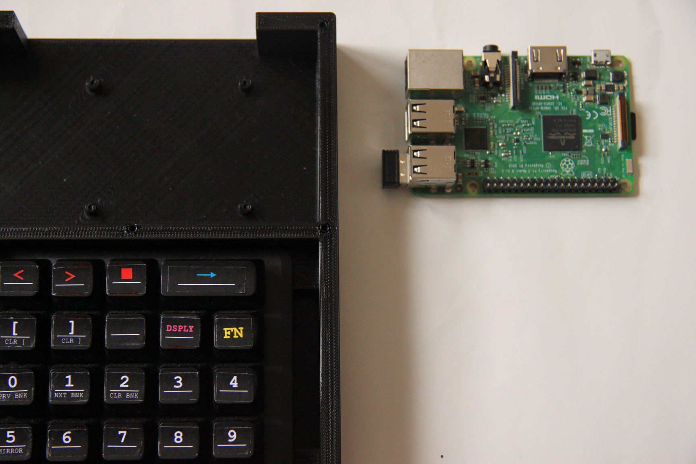

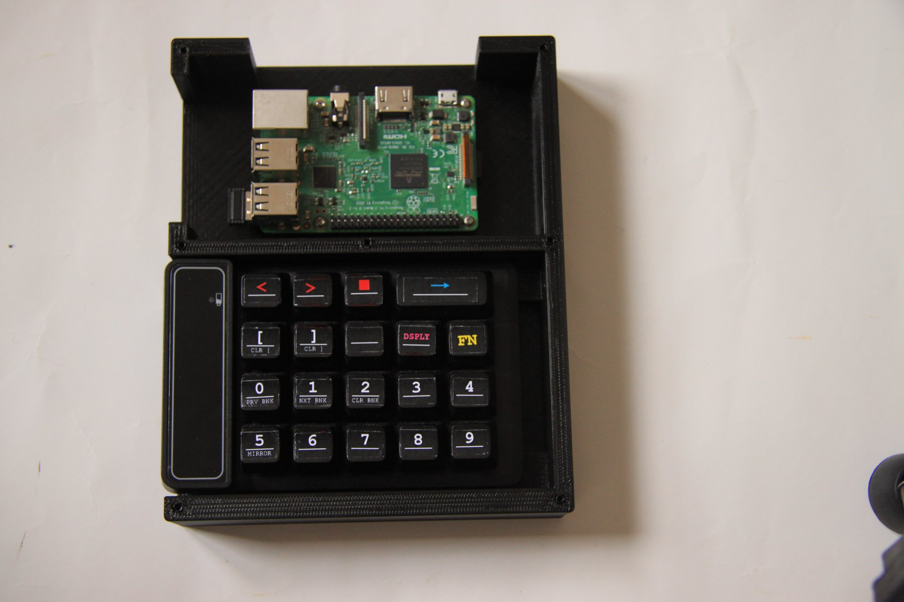 

its easier to flash and insert the sd card before screwing it in !

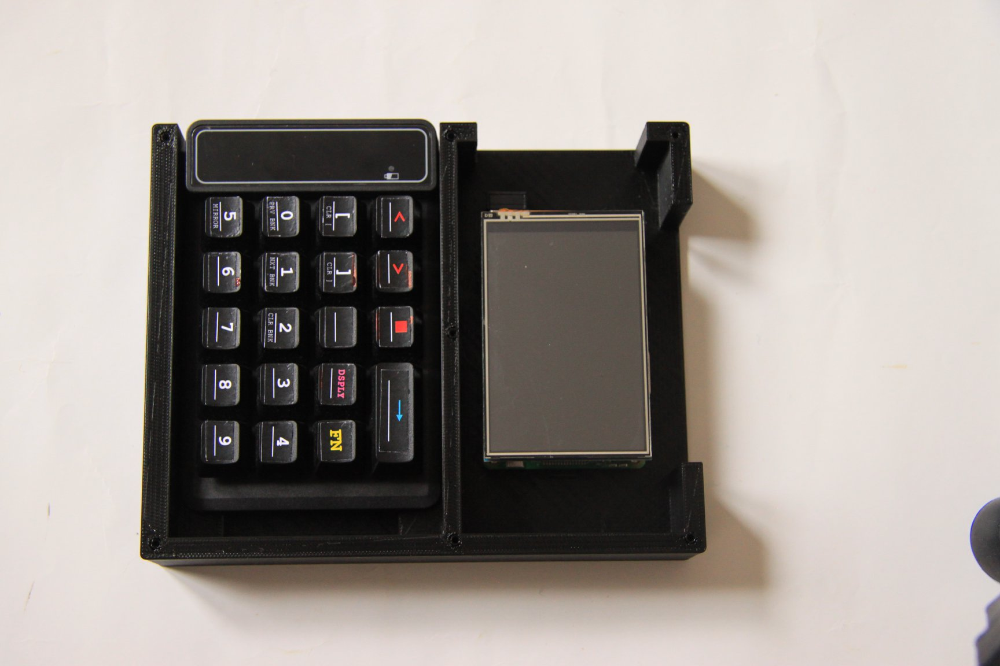 

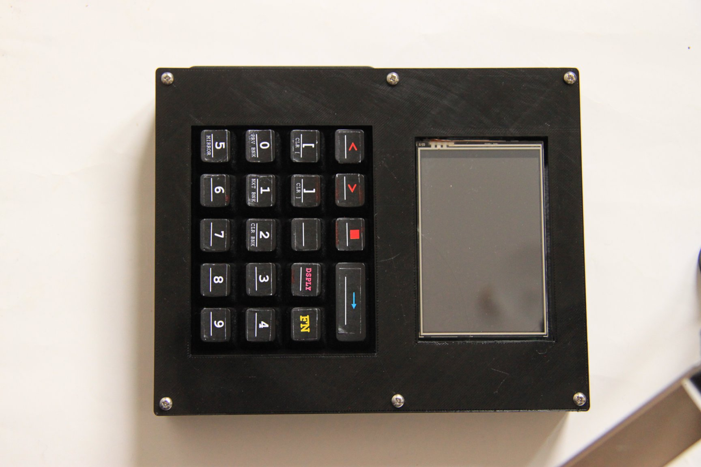 

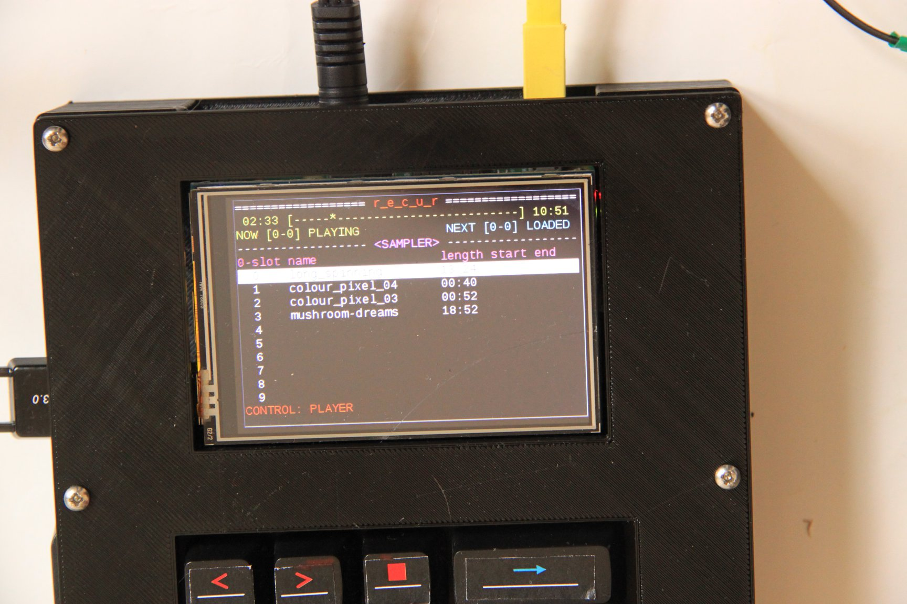 

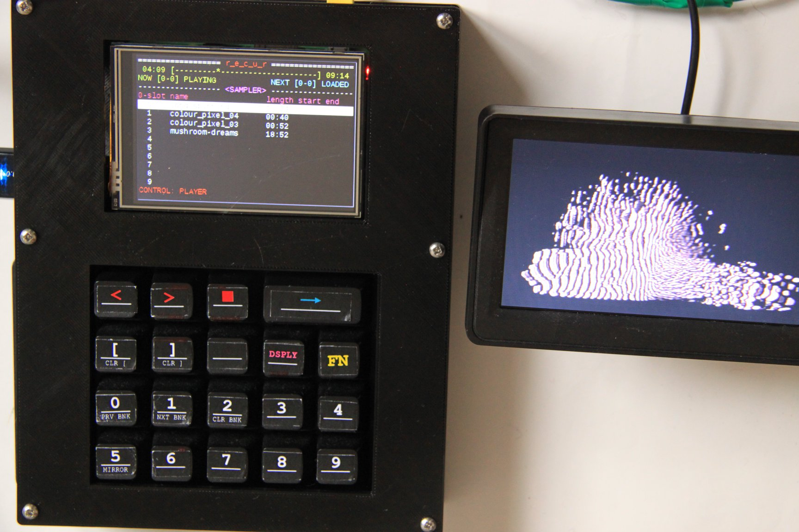 

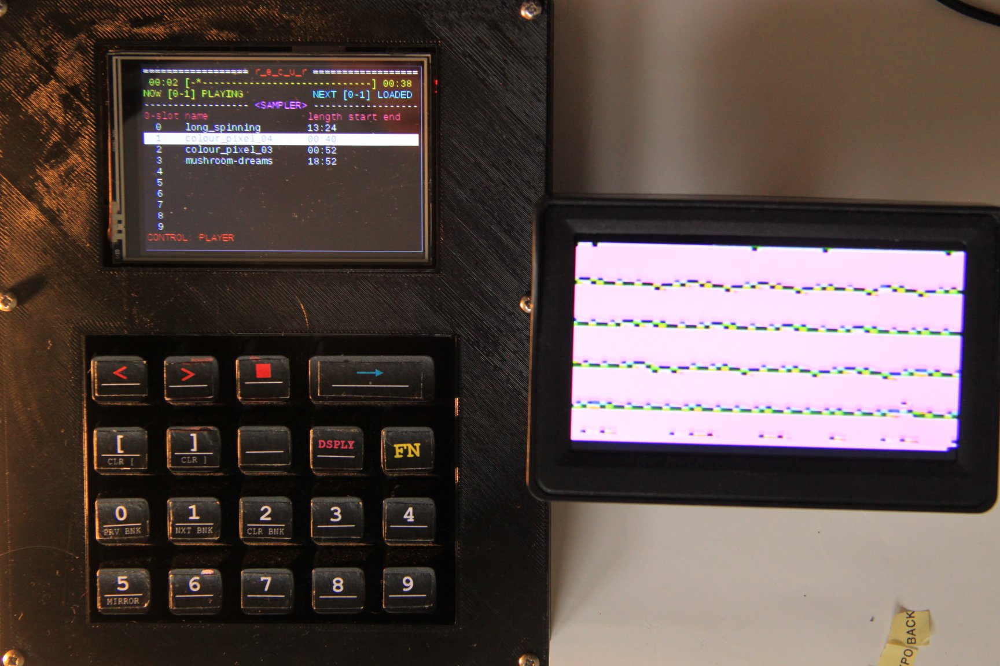 

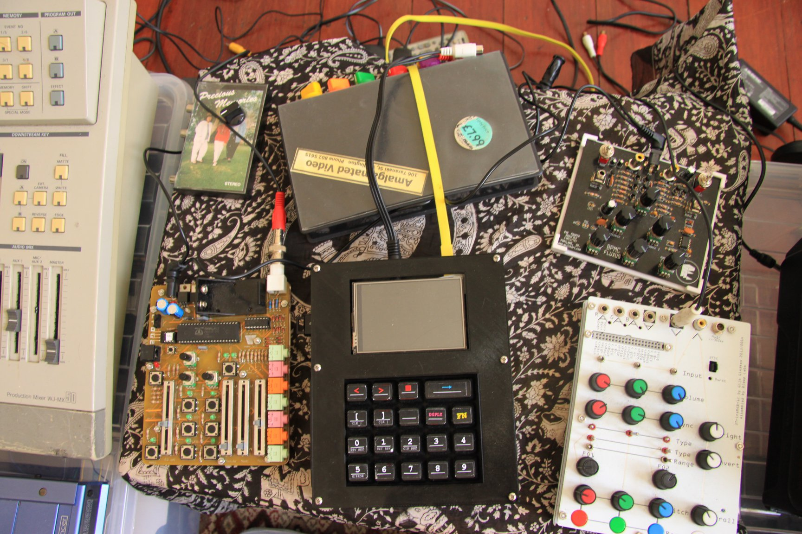 

r_e_c_u_r looking happy among friends !

[raspberry pi3]:https://www.aliexpress.com/item/RS-Version-2016-New-Raspberry-Pi-3-Model-B-Board-1GB-LPDDR2-BCM2837-Quad-Core-Ras/32789942633.html
[main parts]: images/build_all.jpg
[csi capture parts]: images/csi_capture_parts.jpg
[usb capture parts]: images/usb_capture_parts.jpg
[raspberry pi screen]:https://www.aliexpress.com/item/3-5-Inch-TFT-LCD-Moudle-For-Raspberry-Pi-2-Model-B-RPI-B-raspberry-pi/32707058182.html
[usb keypad (AliExpress)]:https://www.aliexpress.com/item/USB-Wireless-Numeric-Keypad-19-Keys-Numpad-Number-Pad-Wireless-2-4GHz-Mini-Receiver-for-Laptop/32821720854.html
[usb keypad (Amazon)]:https://www.amazon.com/gp/product/B076GZDC14/
[raspberry pi camera]:https://www.aliexpress.com/item/RPI2-raspberry-pi-2-model-b-b-plus-camera-5-million-pixels-professional-ip-webcam-module/32403602769.html
[piCaptureSd1]: https://lintestsystems.com/products/picapture-sd1
[easyCap UTV007]: https://www.aliexpress.com/item/32885712014.html
[August VGB300]: https://www.augustint.com/en/productmsg-4-348.html
[composite cable]: https://www.adafruit.com/product/2881
[top]: https://github.com/langolierz/r_e_c_u_r/blob/master/enclosure/topplate.stl
[bottom]: https://github.com/langolierz/r_e_c_u_r/blob/master/enclosure/baseplate.stl
[key stickers]: https://github.com/langolierz/r_e_c_u_r/blob/master/enclosure/keystickers.svg
[etcher]: https://etcher.io
[modified image]: https://github.com/langolierz/r_e_c_u_r/wiki/r_e_c_u_r-imgs
[operate docs]: operate_docs
[instructions to install]: https://github.com/langolierz/r_e_c_u_r/blob/master/dotfiles/README.md
[these rubber feet]: https://www.aliexpress.com/item/40-Self-Adhesive-Rubber-Bumper-Stopper-Non-slip-Feet-Door-Buffer-Pads-Furniture-DIY-Tool/32849514475.html
[faq]: faq